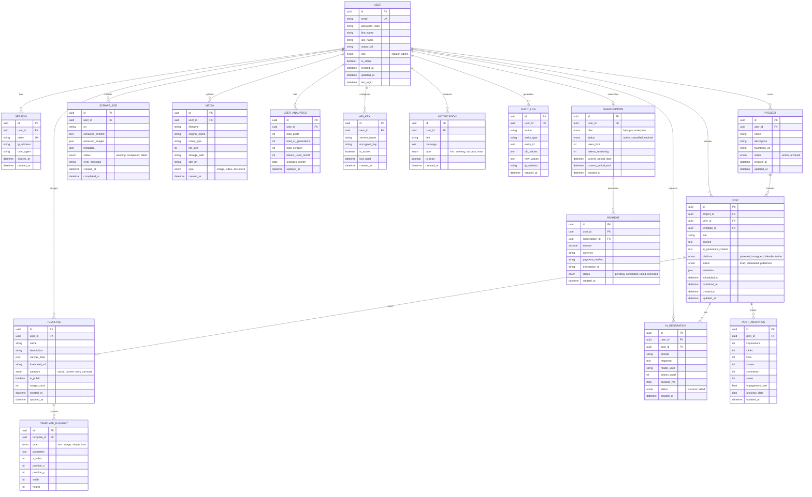

# ReachPilot Entity Relationship Diagram (ERD)

## Figure 4: Database Entity Relationship Diagram

---

## ERD Overview

This Entity Relationship Diagram represents the predicted database schema for ReachPilot, designed to support all current and planned features.

### Entity Groups

| Group                  | Entities                         | Purpose                                  |
| ---------------------- | -------------------------------- | ---------------------------------------- |
| **Users & Auth**       | User, Session                    | Authentication and user management       |
| **Projects & Content** | Project, Post                    | Content organization and creation        |
| **Templates**          | Template, Template_Element       | Canvas-based template design (Fabric.js) |
| **AI & Scraping**      | AI_Generation, Scrape_Job        | Track AI and scraping operations         |
| **Media**              | Media                            | File storage management                  |
| **Analytics**          | Post_Analytics, User_Analytics   | Performance tracking (Recharts)          |
| **Settings**           | API_Key, Notification, Audit_Log | Configuration and logging                |
| **Billing**            | Subscription, Payment            | Future monetization                      |

---

## Key Relationships

| Relationship         | Type        | Description                      |
| -------------------- | ----------- | -------------------------------- |
| User → Project       | One-to-Many | Users own multiple projects      |
| Project → Post       | One-to-Many | Projects contain multiple posts  |
| Post → Template      | Many-to-One | Posts can use a template         |
| Template → Element   | One-to-Many | Templates have multiple elements |
| User → AI_Generation | One-to-Many | Users request AI generations     |
| Post → Analytics     | One-to-Many | Posts track daily analytics      |

---

## Data Types Legend

| Symbol | Meaning          |
| ------ | ---------------- |
| PK     | Primary Key      |
| FK     | Foreign Key      |
| UK     | Unique Key       |
| enum   | Enumeration type |
| json   | JSON/JSONB field |
