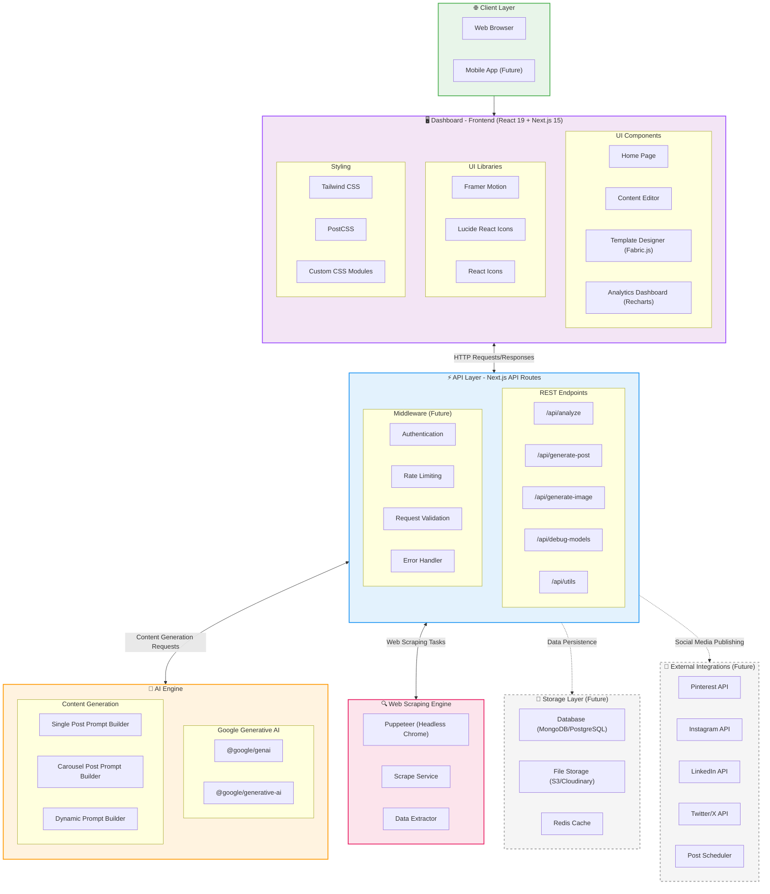

# ReachPilot System Architecture

## Figure 2: System Architecture Diagram

### Legend

- **Solid lines**: Currently implemented connections
- **Dashed lines**: Future implementations
- **Dashed borders**: Planned features

---

## 6.1 System Architecture Description (100 words)

The ReachPilot system architecture follows a three-tier design pattern. The **Dashboard** serves as the user-facing frontend built with React 19 and Next.js 15, providing interfaces for content editing, analytics (Recharts), and template design (Fabric.js). The **API Layer**, built on Next.js API Routes, acts as the critical middleware bridge between the Dashboard and AI Engine. It receives user requests from the Dashboard, validates and processes them through REST endpoints, then routes appropriate requests to the AI Engine. The **AI Engine** leverages Google Gemini for intelligent content generation, Puppeteer for web scraping, and image processing capabilities. The API Layer handles response formatting and delivers processed AI-generated content back to the Dashboard seamlessly.

---

## Technology Stack Summary

| Layer               | Technologies                                                  |
| ------------------- | ------------------------------------------------------------- |
| **Frontend**        | React 19, Next.js 15, TypeScript, Tailwind CSS, Framer Motion |
| **Canvas/Graphics** | Fabric.js                                                     |
| **Charts**          | Recharts                                                      |
| **Icons**           | Lucide React, React Icons                                     |
| **API**             | Next.js API Routes                                            |
| **AI**              | Google Gemini (@google/genai, @google/generative-ai)          |
| **Scraping**        | Puppeteer                                                     |
| **Utilities**       | UUID                                                          |

## Future Implementations

| Feature            | Description                                         |
| ------------------ | --------------------------------------------------- |
| **Database**       | MongoDB/PostgreSQL for persistent storage           |
| **File Storage**   | S3/Cloudinary for images and assets                 |
| **Caching**        | Redis for performance optimization                  |
| **Social APIs**    | Pinterest, Instagram, LinkedIn, Twitter integration |
| **Scheduler**      | Automated post scheduling                           |
| **Mobile App**     | React Native mobile application                     |
| **Authentication** | User auth with JWT/OAuth                            |
