# ReachPilot Use Case Diagram

## Figure 3: Use Case Diagram - Creator vs Admin Roles

```mermaid
flowchart TB
    subgraph Actors["👥 Actors"]
        Creator["🎨 Creator<br/>(Content Creator)"]
        Admin["👔 Admin<br/>(System Administrator)"]
    end

    subgraph CreatorUseCases["🎨 Creator Use Cases"]
        direction TB
        UC1["📝 Create Content"]
        UC2["🖼️ Design Templates"]
        UC3["🤖 Generate AI Content"]
        UC4["🔍 Scrape Web Data"]
        UC5["📊 View Analytics"]
        UC6["📤 Export Posts"]
        UC7["🎨 Edit Graphics"]
        UC8["📱 Preview Posts"]
        UC9["💾 Save Drafts"]
        UC10["📂 Manage Projects"]
    end

    subgraph AdminUseCases["👔 Admin Use Cases"]
        direction TB
        UC11["👥 Manage Users"]
        UC12["🔑 Manage API Keys"]
        UC13["📈 View System Analytics"]
        UC14["⚙️ Configure Settings"]
        UC15["🔒 Manage Permissions"]
        UC16["📋 View Audit Logs"]
        UC17["💰 Manage Billing"]
        UC18["🚨 Monitor System Health"]
        UC19["🔧 Manage Integrations"]
        UC20["📊 Generate Reports"]
    end

    subgraph SharedUseCases["🔄 Shared Use Cases"]
        UC21["🔐 Login/Logout"]
        UC22["👤 Update Profile"]
        UC23["🔔 Manage Notifications"]
        UC24["📧 Contact Support"]
    end

    subgraph System["🖥️ ReachPilot System"]
        subgraph AIEngine["AI Engine"]
            AI1["Content Generation"]
            AI2["Image Processing"]
            AI3["Smart Suggestions"]
        end
        subgraph WebScraper["Web Scraper"]
            WS1["URL Analysis"]
            WS2["Data Extraction"]
        end
        subgraph TemplateEngine["Template Engine"]
            TE1["Canvas Editor"]
            TE2["Template Library"]
        end
        subgraph Analytics["Analytics Engine"]
            AN1["Performance Metrics"]
            AN2["Usage Statistics"]
        end
    end

    %% Creator connections
    Creator --> UC1
    Creator --> UC2
    Creator --> UC3
    Creator --> UC4
    Creator --> UC5
    Creator --> UC6
    Creator --> UC7
    Creator --> UC8
    Creator --> UC9
    Creator --> UC10

    %% Admin connections
    Admin --> UC11
    Admin --> UC12
    Admin --> UC13
    Admin --> UC14
    Admin --> UC15
    Admin --> UC16
    Admin --> UC17
    Admin --> UC18
    Admin --> UC19
    Admin --> UC20

    %% Shared connections
    Creator --> SharedUseCases
    Admin --> SharedUseCases

    %% System interactions
    UC1 --> AIEngine
    UC2 --> TemplateEngine
    UC3 --> AIEngine
    UC4 --> WebScraper
    UC5 --> Analytics
    UC7 --> TemplateEngine
    UC13 --> Analytics

    %% Include relationships
    UC3 -.->|"<<include>>"| AI1
    UC3 -.->|"<<include>>"| AI3
    UC4 -.->|"<<include>>"| WS1
    UC4 -.->|"<<include>>"| WS2
    UC2 -.->|"<<include>>"| TE1
    UC2 -.->|"<<include>>"| TE2

    %% Extend relationships
    UC1 -.->|"<<extend>>"| UC3
    UC1 -.->|"<<extend>>"| UC4

    %% Styling
    style Creator fill:#e8f5e9,stroke:#4CAF50,stroke-width:3px
    style Admin fill:#fff3e0,stroke:#FF9800,stroke-width:3px
    style CreatorUseCases fill:#f3e5f5,stroke:#9C4BFF,stroke-width:2px
    style AdminUseCases fill:#e3f2fd,stroke:#2196F3,stroke-width:2px
    style SharedUseCases fill:#fce4ec,stroke:#E91E63,stroke-width:2px
    style System fill:#f5f5f5,stroke:#607D8B,stroke-width:2px
```

---

## 6.2 Use Case Narrative (50 words)

**Creators** are content professionals who use ReachPilot to generate AI-powered social media posts, design custom templates, scrape web content, and analyze performance. **Admins** manage the platform infrastructure, including user accounts, API keys, permissions, billing, and system monitoring. Both roles share common authentication and profile management capabilities.

---

## Role Permissions Matrix

| Feature                 | Creator | Admin |
| ----------------------- | :-----: | :---: |
| Create/Edit Content     |   ✅    |  ❌   |
| Design Templates        |   ✅    |  ❌   |
| Generate AI Content     |   ✅    |  ❌   |
| Scrape Web Data         |   ✅    |  ❌   |
| View Personal Analytics |   ✅    |  ✅   |
| Export Posts            |   ✅    |  ❌   |
| Manage Users            |   ❌    |  ✅   |
| Manage API Keys         |   ❌    |  ✅   |
| View System Analytics   |   ❌    |  ✅   |
| Configure Settings      |   ❌    |  ✅   |
| Manage Permissions      |   ❌    |  ✅   |
| View Audit Logs         |   ❌    |  ✅   |
| Manage Billing          |   ❌    |  ✅   |
| Monitor System Health   |   ❌    |  ✅   |
| Login/Logout            |   ✅    |  ✅   |
| Update Profile          |   ✅    |  ✅   |

---

## Use Case Descriptions

### Creator Use Cases

| ID   | Use Case            | Description                                         |
| ---- | ------------------- | --------------------------------------------------- |
| UC1  | Create Content      | Write and compose social media posts                |
| UC2  | Design Templates    | Create custom post templates using Fabric.js canvas |
| UC3  | Generate AI Content | Use Google Gemini to generate post text             |
| UC4  | Scrape Web Data     | Extract content from URLs using Puppeteer           |
| UC5  | View Analytics      | Monitor post performance with Recharts              |
| UC6  | Export Posts        | Download posts as images or files                   |
| UC7  | Edit Graphics       | Modify images and graphics                          |
| UC8  | Preview Posts       | View posts before publishing                        |
| UC9  | Save Drafts         | Save work-in-progress content                       |
| UC10 | Manage Projects     | Organize content into projects                      |

### Admin Use Cases

| ID   | Use Case              | Description                        |
| ---- | --------------------- | ---------------------------------- |
| UC11 | Manage Users          | Add, edit, delete user accounts    |
| UC12 | Manage API Keys       | Configure external API credentials |
| UC13 | View System Analytics | Monitor platform-wide usage        |
| UC14 | Configure Settings    | Adjust system configurations       |
| UC15 | Manage Permissions    | Set role-based access controls     |
| UC16 | View Audit Logs       | Track system activities            |
| UC17 | Manage Billing        | Handle subscriptions and payments  |
| UC18 | Monitor System Health | Check server and API status        |
| UC19 | Manage Integrations   | Configure third-party connections  |
| UC20 | Generate Reports      | Create administrative reports      |
